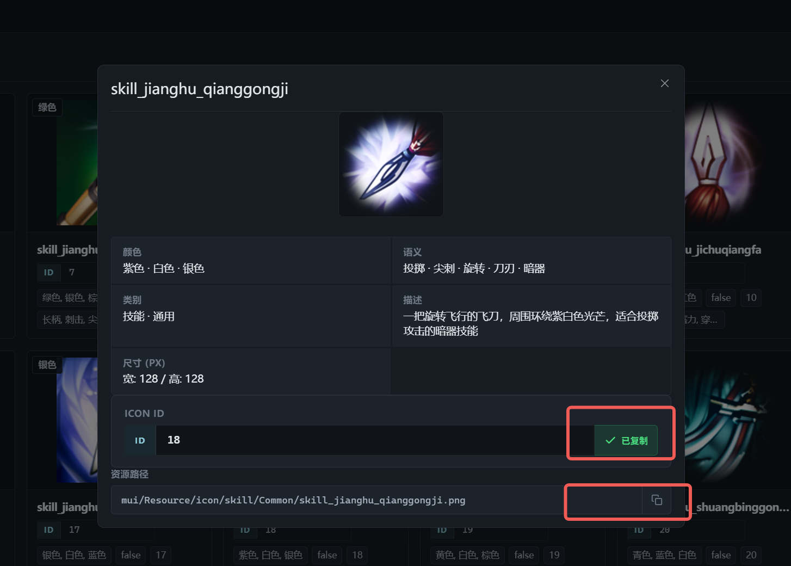

# Agivar 反编译架构洞察与落地建议

> 基于 Agivar v1.2.0 反编译分析 + 本项目的落地方案与各阶段设计文档
> 目标：从真实可运行产品中提取架构级参考，加速我们自己的设计决策

---

## 一、核心发现摘要

Agivar v1.2.0.721 是一个成熟的产品级 Electron + React 桌面 AI 助手，代码签名主体为北京非十科技有限公司。反编译揭示了以下关键架构模式：

| 发现 | 我们的状态 | 建议优先级 |
|---|---|---|
| **131 个 IPC 通道**按域组织（`chat:`/`recording:`/`settings:`/`auth:`/`payment:`） | Phase 1 实现了基础 IPC，但规模远小于此 | **P0 立即采纳** |
| **独立窗口架构**：main / capture / recording_bar / overlay_todo / overlay_gradient 五个页面 | Phase 4A 规划了录制条窗口，但尚未实现 | **P1 规划中采纳** |
| **录制状态通过事件推送**（`recording:state`）而非轮询 | Phase 4A 已规划 `onStateChanged`，与 Agivar 一致 | **P0 确认方向** |
| **Frame metadata 与 frame payload 分离** | Phase 3/4C 已规划此模式 | **P0 确认方向** |
| **录制归档格式** (.rz 加密归档 + AES) | 规划了本地存储但未设计归档格式 | P2 后续参考 |
| **本地 MCP 服务**（5 个工具，端口 17342） | 已列为后置项 | P3 远期参考 |
| **Service 注册模式**启动时集中注册 | Phase 1 已采用 service 模式 | **P0 确认方向** |
| **结构化 memory 工具**（list/read/update） | Phase 2 规划了 text-teaching-service | P1 增强中采纳 |

---

## 二、IPC 架构设计参考

### 2.1 Agivar 的 IPC 组织方式

Agivar 将 131 个 IPC 通道按功能域严格分组，每个域使用 `domain:action` 命名约定：

```
核心域分类：
├── window:      is_maximized / minimize / maximize_toggle / close / maximized_changed
├── auth:        login_browser / cancel_browser / pending_url / logout / load_session / session_expired / current_user
├── chat:        list / create / open / delete / title / set_mode / set_model / send / stop / resume / event / ...
├── recording:   start / stop / cancel / discard_prev / state / get_state / bar_action / mic_capture / audio_pcm / ...
├── recordings:  list / rename / delete / frame_meta / frame
├── settings:    get_language / set_language / language_changed / get_developer_code / set_developer_code / ...
├── permissions: check_required / open_settings / ensure_microphone
├── update:      check / install / flush_pending / available / download_progress
├── payment:     get_products / create_order / get_order / get_balance / list_orders / close_order
├── phone:       send_code / verify / get_status
├── credit:      records / usages
├── analytics:   button_click / task_control
├── media:       open_local_image
├── shell:       open_external
├── cu_overlay:  action / drag / resize / event
└── ping
```

**关键洞察**：每个域独立演进，互不干扰。新增支付/手机号时只需追加 `payment:` 和 `phone:` 命名空间，不影响现有通道。

### 2.2 对我们项目的建议

当前我们的 IPC 定义分散在各个 service 文件中，缺乏统一的命名规范。建议：

**立即采纳**：在 `packages/desktop/src/shared/ipc-channels.ts` 中建立统一的 IPC 通道常量：

```typescript
// 推荐的 IPC 通道命名规范
export const IPC = {
  // 基础
  PING: 'app:ping',
  
  // 窗口
  WINDOW_IS_MAXIMIZED: 'window:is-maximized',
  WINDOW_MINIMIZE: 'window:minimize',
  WINDOW_MAXIMIZE_TOGGLE: 'window:maximize-toggle',
  WINDOW_CLOSE: 'window:close',
  WINDOW_MAXIMIZED_CHANGED: 'window:maximized-changed',
  
  // 聊天 Agent
  AGENT_RUN: 'agent:run',
  AGENT_STOP: 'agent:stop',
  AGENT_EVENT: 'agent:event',
  AGENT_TAKEOVER_RESUME: 'agent:takeover-resume',
  
  // 录屏
  RECORDING_START: 'recording:start',
  RECORDING_STOP: 'recording:stop',
  RECORDING_CANCEL: 'recording:cancel',
  RECORDING_STATE_CHANGED: 'recording:state-changed',
  RECORDING_GET_STATE: 'recording:get-state',
  
  // 录屏教学 (Phase 4A+)
  RECORDING_ANNOTATION_SUBMIT: 'recording:annotation-submit',
  RECORDING_ANNOTATION_EDIT: 'recording:annotation-edit',
  RECORDING_ANNOTATION_DELETE: 'recording:annotation-delete',
  RECORDING_EXPLAIN_SUBMIT: 'recording:explain-submit',
  RECORDING_PANEL_SUBMIT: 'recording:panel-submit',
  
  // 录制管理 (Phase 4C+)
  RECORDINGS_LIST: 'recordings:list',
  RECORDINGS_RENAME: 'recordings:rename',
  RECORDINGS_DELETE: 'recordings:delete',
  RECORDINGS_FRAME_META: 'recordings:frame-meta',
  RECORDINGS_FRAME: 'recordings:frame',
  
  // 设置
  SETTINGS_GET: 'settings:get',
  SETTINGS_SET: 'settings:set',
  SETTINGS_CHANGED: 'settings:changed',
  
  // 更新 (后置)
  UPDATE_CHECK: 'update:check',
  UPDATE_INSTALL: 'update:install',
  UPDATE_AVAILABLE: 'update:available',
} as const;
```

**设计原则**：
- 所有 IPC 通道必须在此文件定义，不得使用字符串字面量
- 新功能域使用新的命名空间前缀，保持向后兼容
- Handler 注册也对应分组，方便查找和管理

---

## 三、多窗口架构设计

### 3.1 Agivar 的多窗口模式

Agivar 不是单一窗口应用，而是"主窗口 + 多个辅助窗口"的架构：

| 页面 | HTML 入口 | 作用推断 |
|---|---|---|
| `pages/main/index.html` | 主聊天/登录/设置界面 | 主要交互入口 |
| `pages/capture/index.html` | 屏幕捕获或截图预览 | 捕获预览窗口 |
| `pages/recording_bar/index.html` | 录制控制条 | 半透明浮窗，可拖动 |
| `pages/overlay_todo/index.html` | 任务/待办悬浮层 | 任务进度显示 |
| `pages/overlay_gradient/index.html` | 悬浮渐变遮罩 | 隐私遮挡 |

对应的渲染资源独立打包：`capture.js` (91KB)、`recording_bar.js` (52KB)、`overlay_todo.js` (12KB)、`i18n.js` (36KB, 324 个翻译 key)。

### 3.2 对我们的建议

**Phase 4A 录制条窗口设计建议**：

Agivar 的 recording_bar 通过专用 IPC 与主进程通信，关键 IPC 包括：

```
recording:bar_action        — 录制条按钮点击（暂停/继续/停止）
recording:bar_drag_start    — 拖拽开始
recording:bar_drag_end      — 拖拽结束
recording:bar_drag_move     — 拖拽移动
recording:bar_set_interactive — 设置是否可交互
recording:bar_set_position  — 设置位置
recording:bar_get_bounds    — 获取边界
recording:bar_resize        — 尺寸变化
recording:bar_resize_ack    — 尺寸确认
recording:bar_count         — 录制计数更新
```

窗口创建模式（参考 Agivar）：

```typescript
// 推荐的录制条窗口创建方式
function createRecordingBarWindow(): BrowserWindow {
  const win = new BrowserWindow({
    width: 320,
    height: 48,
    frame: false,           // 无边框
    transparent: true,      // 透明背景
    alwaysOnTop: true,      // 置顶
    resizable: false,
    skipTaskbar: true,      // 不显示在任务栏
    webPreferences: {
      preload: PRELOAD_PATH,
      contextIsolation: true,
      nodeIntegration: false,
    },
  });

  // 加载独立打包的 recording_bar 页面
  if (isDev) {
    win.loadURL('http://localhost:5173/pages/recording-bar/');
  } else {
    win.loadFile(path.join(__dirname, '../renderer/pages/recording_bar/index.html'));
  }

  return win;
}
```

**建议的窗口创建时机**：
- Phase 4A：先做嵌入式面板（在 main 页面内），快速验证功能闭环
- Phase 4C+：升级为独立窗口，添加拖拽/置顶/透明等能力
- 后续阶段：添加 overlay_todo（任务进度浮窗）、capture（捕获预览）

---

## 四、录制系统架构深度参考

### 4.1 Agivar 的录制管线

Agivar 的录制系统是最复杂的模块之一，反编译揭示了完整的录制生命周期：

```
录制生命周期：
  start → recording (帧捕获+音频采集) → stop
    → processing (云端上传+处理流水线)
    → 生成录屏描述 + 关键帧列表
    → 用户 review → 确认入库 / discard
```

**关键模块分解**：

| 模块 | 文件 | 职责 |
|---|---|---|
| 主录制服务 | `main/deobfuscated.js` (recording 段) | 管理录制会话、帧捕获、状态机 |
| 归档器 | `main-chunks/archiver/` | .rz 加密归档：压缩、AES 加密、分帧读取 |
| 录制迁移 | `main-chunks/recording_migration/` | 旧格式录制迁移到新格式 |
| 同步任务 | `main-chunks/sync_task/` | 录制云端同步调度 |
| 录制附着 | `main-chunks/attach_bar/` | 录制进度条和附着到聊天 |
| 选择器 | `main-chunks/selectable/` | 录制选择和管理逻辑 |
| 测试工具 | `main-chunks/harness/` | 录制模拟创建、校验 |

### 4.2 录制数据模型

Agivar 的录制在磁盘上的组织方式（从 storage-map 推断）：

```
~/.agivar/
├── datas/
│   └── screen_recordings/          # 录制根目录
│       ├── {rec_id}.rz             # 加密归档文件（主格式）
│       ├── {rec_id}.rz.pending     # 同步中标记文件
│       ├── {rec_id}.rz.vid         # 视频元信息 sidecar
│       ├── {rec_id}.thumb.jpg      # 缩略图
│       ├── .tmp_rec_{id}/          # 录制中临时目录
│       │   └── original/
│       │       ├── live.json       # 实时状态
│       │       ├── audio.wav       # 音频文件
│       │       └── annotations.json # 注释数据
│       └── .tmp_{id}/              # 通用临时目录
├── conversations.data              # 对话数据（二进制格式）
├── scripts/                        # 脚本存储
├── todos/                          # 任务数据
├── errors/                         # 错误日志
├── analytics/                      # 埋点数据
│   ├── state.json
│   └── outbox.jsonl
├── session.json                    # 会话数据
├── settings.json                   # 设置
├── model_prefs.json                # 模型偏好
└── update_prefs.json               # 更新偏好
```

### 4.3 对我们的建议

**Phase 3 录屏教学的数据存储建议**：

```
推荐的本地录屏目录结构（~/.agivar/）：
├── recordings/
│   ├── {rec_id}/
│   │   ├── original/
│   │   │   ├── keyframes/          # 关键帧 PNG
│   │   │   │   ├── frame_00001.png
│   │   │   │   └── ...
│   │   │   ├── events.json         # 事件时间轴
│   │   │   ├── annotations.json    # 用户注释
│   │   │   └── audio.wav           # 音频（可选）
│   │   ├── processed/
│   │   │   ├── video.mp4           # 编码视频（可选）
│   │   │   └── thumb.jpg           # 缩略图
│   │   ├── generated/
│   │   │   └── workflow_draft.json # 生成的流程草稿
│   │   └── meta.json               # 元信息
│   └── .pending/                   # 待处理/同步
├── conversations/
│   └── ...                         # SQLite 管理的对话数据
└── settings/
    └── settings.json
```

**关键设计原则（从 Agivar 学到的）**：

1. **Frame metadata 与 frame payload 分离**：列表只加载 metadata，按需加载帧图片
2. **录制状态通过事件推送**：`recording:state-changed` 事件，渲染层不轮询
3. **独立临时目录**：录制中使用 `.tmp_rec_{id}` 隔离，避免与已完成录制混淆
4. **归档格式**：录制完成后打包为单一文件（Agivar 用 .rz，我们可用 .zip 或自定义格式）
5. **清理机制**：`forceStopAllRecordings()` 全局清理函数，防止资源泄漏

---

## 五、Service 注册与启动模式

### 5.1 Agivar 的启动流程

从反编译代码分析，主进程启动流程如下：

```
app.whenReady() → 
  1. 设置语言
  2. 安装应用菜单
  3. 创建主窗口
  4. 注册权限服务 → ipcMain.handle('permissions:*')
  5. 注册聊天服务 → ipcMain.handle('chat:*') + ipcMain.on('chat:event')
  6. 注册录屏服务 → ipcMain.handle('recording:*') + 录制状态机初始化
  7. 注册录屏管理服务 → ipcMain.handle('recordings:*')
  8. 启动 MCP 本地服务 → 监听 127.0.0.1:17342/mcp
  9. 上报安装/冷启动事件 → PostHog
  10. 创建系统托盘 → Tray + Menu
  11. 初始化 Overlay 管理器 → BrowserWindow for overlays
  12. 启动更新检查 → 定时检查 + 通知
```

每个服务独立注册，互不依赖，便于按阶段启用/禁用。

### 5.2 对我们的建议

我们的 Phase 1 已经采用了类似的 service 模式。建议进一步规范化：

```typescript
// 推荐的 main process 入口结构
// packages/desktop/src/main/index.ts

import { registerWindowService } from './services/window-service';
import { registerAgentService } from './services/agent-service';
import { registerRecordingService } from './services/recording-service';
import { registerSettingsService } from './services/settings-service';
import { registerUpdateService } from './services/update-service';

app.whenReady().then(async () => {
  // Phase 1: 基础服务
  registerWindowService();      // 窗口管理
  registerAgentService();       // Agent 执行（chat:* IPC）
  registerSettingsService();    // 设置读写

  // Phase 3: 录制服务（按阶段条件启用）
  if (featureFlags.recording) {
    registerRecordingService(); // 录制控制
  }

  // Phase 4+: 后续服务
  if (featureFlags.updates) {
    registerUpdateService();    // 自动更新
  }

  createMainWindow();
  createTray();
});
```

**每个 service 模块模式**：

```typescript
// services/recording-service.ts
export function registerRecordingService() {
  ipcMain.handle(IPC.RECORDING_START, async (_, opts) => { ... });
  ipcMain.handle(IPC.RECORDING_STOP, async (_, id) => { ... });
  ipcMain.handle(IPC.RECORDING_CANCEL, async (_, id) => { ... });
  ipcMain.handle(IPC.RECORDING_GET_STATE, async (_, id) => { ... });
  // 事件推送通过 mainWindow.webContents.send(IPC.RECORDING_STATE_CHANGED, ...)
}
```

---

## 六、Memory 系统设计参考

### 6.1 Agivar 的 Memory 工具

Agivar 在 Agent 的 system prompt 中内置了三个 memory 工具：

| 工具 | 参数 | 说明 |
|---|---|---|
| `list_memory` | `platform` (可选) | 列出所有记忆条目，按平台过滤 |
| `read_memory` | `platform`, `topic` | 读取特定记忆的完整内容 |
| `update_memory` | `platform`, `topic`, `short_description`, `memory_old_string`, `memory_new_string` | 增量更新记忆 |

Memory 按 `platform/topic` 组织。平台可以是 `bilibili`、`vscode`、`general` 等自由文本。`update_memory` 使用 `old_string → new_string` 的替换模式，类似 sed 的语义。

### 6.2 对我们的建议

我们的 `memory-store.ts` 已经实现了 search/getById/save/delete 基础操作。建议增强：

```typescript
// 推荐的 memory 工具接口（在 Phase 2 增强）
interface MemoryTools {
  // 已有
  search(query: string): Promise<MemorySearchResult[]>;
  getById(id: string): Promise<WorkflowMemory | null>;
  save(memory: WorkflowMemory): Promise<void>;
  delete(id: string): Promise<void>;

  // 新增（参考 Agivar）
  listByPlatform(platform: string): Promise<MemorySummary[]>;  // 只返回摘要列表
  read(platform: string, topic: string): Promise<WorkflowMemory | null>;  // 按平台/主题读取
  updateSection(  // 增量更新记忆内容
    platform: string,
    topic: string,
    newDescription: string,
    oldSection: string,
    newSection: string,
  ): Promise<{ ok: boolean; message: string }>;
  buildIndex(): Promise<string>;  // 生成索引文本注入 Agent context
}

interface MemorySummary {
  platform: string;
  topic: string;
  description: string;  // 一行摘要
}
```

**记忆索引注入**：Agent 启动时将索引文本注入 system prompt，让 Agent 知道有哪些可用记忆。需要时才读取完整内容。

---

## 七、MCP 本地服务设计参考

### 7.1 Agivar 的 MCP 工具

Agivar 暴露了 5 个本地 MCP 工具，监听 `127.0.0.1:17342/mcp`：

| 工具 | 参数 | 说明 |
|---|---|---|
| `run_gui_task` | `task` (string), `context` (string) | 执行 GUI 自动化任务 |
| `get_task_result` | `task_id` (string) | 获取任务执行结果 |
| `cancel_task` | `task_id` (string) | 取消任务 |
| `get_status` | (无) | 获取 Agent 状态 |
| `send_task_message` | `task_id` (string), `message` (string) | 向运行中的任务发送消息 |

使用了 `@modelcontextprotocol/sdk` 的 `streamableHttp` 传输方式。

### 7.2 对我们的建议

MCP 本地服务已列为后置项，暂不进入 Phase 2/3/4 主路径。但架构上应预留：

1. **端口选择**：使用固定端口 + 回退到随机端口 + 写入文件供外部工具发现
2. **安全性**：绑定 `127.0.0.1` 仅本地可访问，考虑 token 认证
3. **工具设计**：聚焦在任务执行和状态查询，不过早暴露过多内部接口

---

## 八、安全与隐私设计参考

### 8.1 Agivar 的安全措施

从反编译观察到的安全相关设计：

| 措施 | 实现方式 |
|---|---|
| 代码签名 | Authenticode 证书（GlobalSign CA） |
| 录制加密 | `.rz` 格式使用 AES 加密 + SHA256 校验 |
| 会话安全 | Logto OAuth 2.0 + PKCE |
| 环境变量配置 | `AGIVAR_*` 前缀覆盖默认路径 |
| Console 关闭 | 打包态关闭 console.log/info/debug/warn |
| 单实例锁 | `requestSingleInstanceLock()` 防止多开 |

### 8.2 对我们的建议

Phase 3 录制阶段应引入：

1. **录制加密选项**：可选 AES 加密录制文件，特别是包含敏感信息的场景
2. **环境变量配置**：允许通过环境变量覆盖数据目录、设置文件等路径（方便测试/调试）
3. **单实例锁**：防止多个实例同时运行导致资源冲突

---

## 九、渲染层架构参考

### 9.1 Agivar 的前端组织

Agivar 的渲染层按页面独立打包：

| Bundle | 大小 | 用途 |
|---|---|---|
| 主 bundle | ~50MB (原始) | 主聊天应用，含 React、Markdown、KaTeX、Highlight.js |
| capture.js | 91KB | 屏幕捕获页面 |
| recording_bar.js | 52KB | 录制控制条 |
| overlay_todo.js | 12KB | 任务悬浮窗 |
| i18n.js | 36KB | 国际化（324 个 key） |
| browser.js | 62KB | 浏览器二维码相关 |

独立打包意味着每个页面只加载自己需要的代码，不会把全部依赖打到一起。

### 9.2 对我们的建议

Phase 4A+ 应参考此模式：

```
packages/desktop/src/renderer/
├── pages/
│   ├── main/             # 主应用页面（Phase 1+）
│   │   ├── index.html
│   │   └── main.tsx
│   ├── recording-bar/    # 录制控制条（Phase 4A+）
│   │   ├── index.html
│   │   └── recording-bar.tsx
│   ├── capture/          # 捕获预览（Phase 4C+）
│   │   ├── index.html
│   │   └── capture.tsx
│   └── overlay-todo/     # 任务进度（Phase 4C+）
│       ├── index.html
│       └── overlay-todo.tsx
├── shared/               # 跨页面共享模块
│   ├── ipc-client.ts     # window.api 类型定义
│   ├── hooks/            # 共享 hooks
│   └── components/       # 共享组件
└── i18n/                 # 国际化（Phase 4+）
    └── zh-CN.ts
```

使用 Vite 的 multi-page 配置实现：

```typescript
// vite.config.ts (renderer)
export default defineConfig({
  build: {
    rollupOptions: {
      input: {
        main: 'src/renderer/pages/main/index.html',
        'recording-bar': 'src/renderer/pages/recording-bar/index.html',
        // Phase 4C+ 添加更多页面
      },
    },
  },
});
```

---

## 十、版本演进参考

### 10.1 Agivar 的版本演进

| 版本 | 关键变化 |
|---|---|
| 1.1.4 → 1.2.0 | 新增支付、手机号、额度系统、屏幕范围设置、二维码、国际化拆包、浏览器资源 |

从 1.1.4 到 1.2.0 的主要增量：
- 新增 `qrcode` 依赖
- 独立 `browser-*.js` 和 `i18n-*.js` 渲染资源
- 新增 10+ API 端点（支付/手机号/额度/批量删除）
- 主 bundle 增长约 2MB

### 10.2 对我们的建议

版本规划启示：
1. **先做核心闭环，再叠加商业化**：Agivar 1.1.4 已有完整的聊天+录屏功能，1.2.0 才加入支付。我们应优先确保录屏教学闭环稳定，商业化后置
2. **国际化预留结构但延后实现**：在渲染层预留 i18n 目录，但 Phase 1-3 只用中文硬编码
3. **功能按独立模块组织**：新增功能作为独立 chunk/页面，不污染主 bundle

---

## 十一、关键决策对照表

| 决策点 | Agivar 的做法 | 我们当前的做法 | 建议 |
|---|---|---|---|
| IPC 通道管理 | 集中常量定义，按域分组 | 分散在各 service 文件中 | **立即统一**到 `ipc-channels.ts` |
| 窗口架构 | 多页面独立打包 | 主要单页面 | Phase 4A+ 逐步拆分 |
| 录制数据格式 | .rz 加密归档 | 原始文件 + events JSON | Phase 3 考虑归档格式 |
| Memory 模型 | platform/topic 组织 + 增量更新 | ID 索引 + 全文替换 | Phase 2 增加增量更新能力 |
| Agent 工具 | 内置 memory/todo_write 工具 | 仅工具调度 | 后续增加 memory 管理工具 |
| 状态推送 | 事件驱动 (IPC events) | 部分轮询 | 全部改为事件推送 |
| 启动流程 | 分步 service 注册 | 类似模式 | 规范化 service 注册顺序 |
| 环境配置 | 环境变量覆盖路径 | 无 | Phase 2+ 添加 |

---

## 十二、立即执行清单

以下事项建议在当前阶段立即实施，成本低但长期收益高：

1. **[P0]** 建立统一的 `ipc-channels.ts` 常量文件，重命名现有 IPC 通道
2. **[P0]** 所有录制状态通信改为事件推送模式 (`recording:state-changed`)
3. **[P1]** 在 `package.json` 中添加 `AGIVAR_*` 环境变量支持
4. **[P1]** Memory 接口预留 `listByPlatform` / `read` / `updateSection` 方法签名
5. **[P2]** 渲染层建立 pages 目录结构，为多页面做准备
6. **[P2]** 主进程入口规范化为 service 注册模式 `registerXxxService()`
7. **[P2]** 添加单实例锁 (`requestSingleInstanceLock()`)